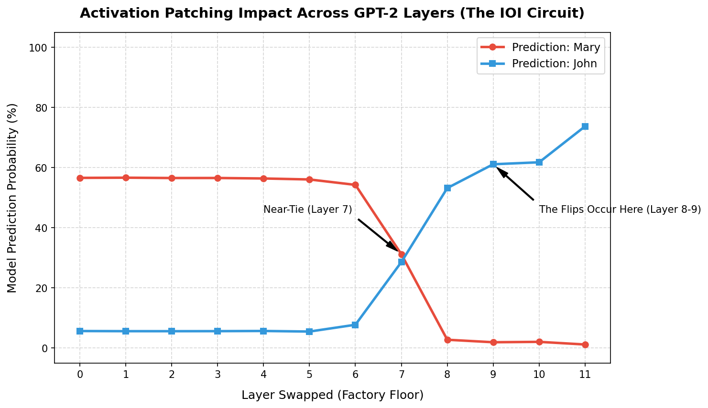

# Mechanistic Interpretability: Activation Patching on GPT-2 Small

This project explores the internal causal mechanisms of large language models. Specifically, it maps out the **Indirect Object Identification (IOI)** circuit inside `gpt2-small` using activation patching via the `transformer_lens` library.

## 🎯 The Experiment
We investigate how the model resolves the target name in the following prompts:
* **Clean Prompt:** `"John and Mary went to the store. John gave a drink to"` (Target: Mary)
* **Corrupted Prompt:** `"John and Mary went to the store. Mary gave a drink to"` (Target: John)

By surgically swapping internal residual stream activations from the corrupted run into the clean run at the final token position (`"to"`), we locate the critical bottleneck layer responsible for this linguistic reasoning.

## 📊 Key Results
* **Baseline Run:** The model initially predicts **Mary** with high confidence.
* **Layer 7 Patching:** Logit probabilities drop into a near-tie (**Mary: 31.18% vs. John: 28.56%**), proving Layer 7 is highly disruptive to the circuit.
* **Layer 9 Patching:** The prediction completely flips (**John: 61.09% vs. Mary: 1.89%**), establishing Layer 9 as the critical decision bottleneck for name-tracking.

### Circuit Visualization
Below is the data tracked across all 12 layers of the model:

## 🛠️ Tech Stack & Tools
* **Language:** Python
* **Frameworks:** PyTorch
* **Interpretability Tools:** TransformerLens (`HookedTransformer`)
* **Visualization:** Matplotlib

